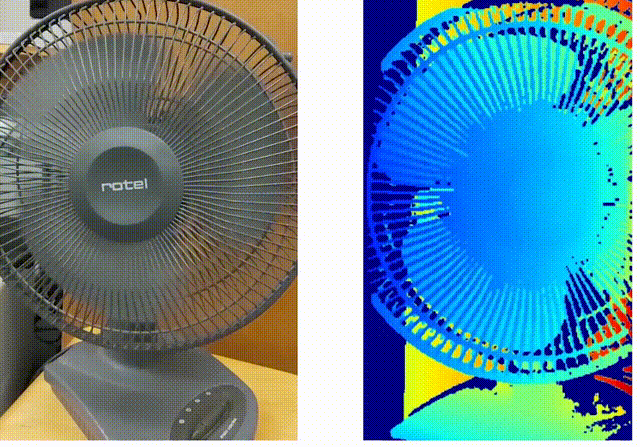
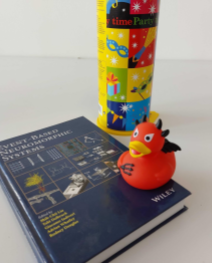
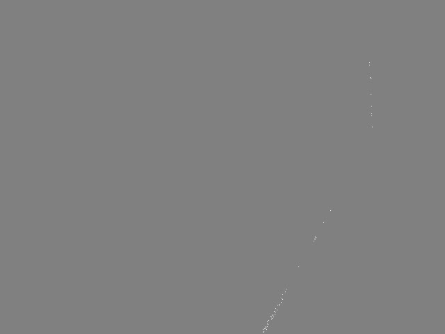
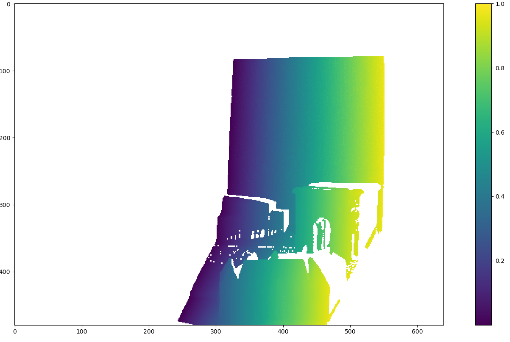
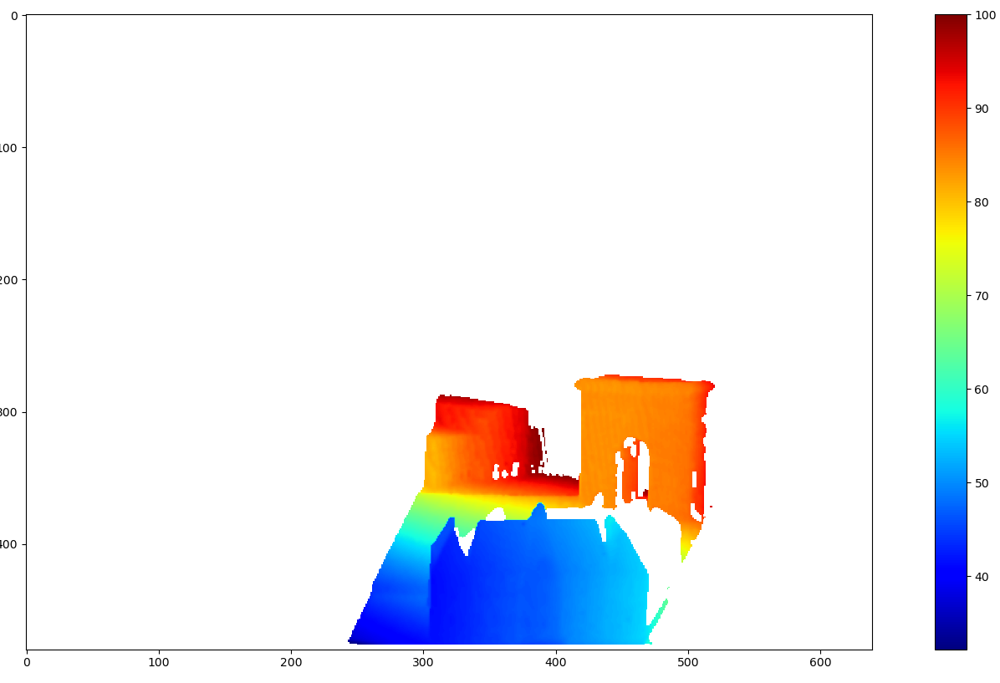

# ESL: Event-based Structured Light

### Video (click on the image)
[](https://youtu.be/SITmvZ8VLfs)

This is the code for the 2021 3DV paper [**ESL: Event-based Structured Light**](http://rpg.ifi.uzh.ch/docs/3DV21_Muglikar_ESL.pdf) by [Manasi Muglikar](https://scholar.google.com/citations?user=LCn8KygAAAAJ&hl=en), [Guillermo Gallego](http://www.guillermogallego.es), and [Davide Scaramuzza](http://rpg.ifi.uzh.ch/people_scaramuzza.html).


### Citation

A pdf of the paper is [available here](http://rpg.ifi.uzh.ch/docs/3DV21_Muglikar_ESL.pdf). 
If you use this code in an academic context, please cite the following work:

```bibtex
@InProceedings{Muglikar213DV,
  author = {Manasi Muglikar and Guillermo Gallego and Davide Scaramuzza},
  title = {ESL: Event-based Structured Light},
  booktitle = {{IEEE} International Conference on 3D Vision.(3DV)},
  month = {Dec},
  year = {2021}
}
```

## Installation

```bash
 conda create -y -n ESL python=3.
 conda activate ESL
 conda install numba
 conda install -y -c anaconda numpy scipy
 conda install -y -c conda-forge h5py opencv tqdm matplotlib pyyaml pylops
 conda install -c open3d-admin -c conda-forge open3d
```

<p align="left">
   
   
</p>


## Data pre-processing
The recordings are available in numpy file format [here](http://rpg.ifi.uzh.ch/esl.html). 
You can downlaoad the `city_of_lights` events file from [here](http://rpg.ifi.uzh.ch/data/esl/static/city_of_lights/scans_np.zip).
Please unzip it and ensure the data is organized as follows:
```bash
-dataset
  calib.yaml
  -city_of_lights/
    -scans_np/
      -cam_ts00000.npy
      .
      .
      .
      -cam_ts00060.npy
```
The numpy file refers to the camera time map for each projector scan.
The time map is normalized in the range [0, 1].
The time map for the `city_of_lights` looks as follows:

<p align="left">
   
</p>

The calibration file for our setup, [data/calib.yaml](data/calib.yaml), follows the OpenCV yaml format.


## Depth computation
To compute depth from the numpy files use the script below:
```bash
    python python/compute_depth.py -object_dir=dataset/static/city_of_lights/ -calib=dataset/calib.yaml -num_scans 1
```
The estimated depth will be saved as numpy files in the `depth_dir/esl_dir` subfolder of the dataset directory.
The estimated depth for the `city_of_lights` dataset can be visualized using the visualization script `visualize_depth.py`:
<p align="left">
   
</p>

## Evaluation
We evaluate the performance for static sequences using two metrics with respect to ground truth: root mean square error (RMSE) and Fill-Rate (i.e., completion).
```bash
python python/evaluate.py -object_dir=dataset/static/city_of_lights
```
The output should look as follows:
```bash
Average scene depth:  105.47189659236103
============================Stats=============================
========== ESL stats ==============
Fill rate: 0.9178120881189983
RMSE: 1.160292387864739
=======================================================================
```
