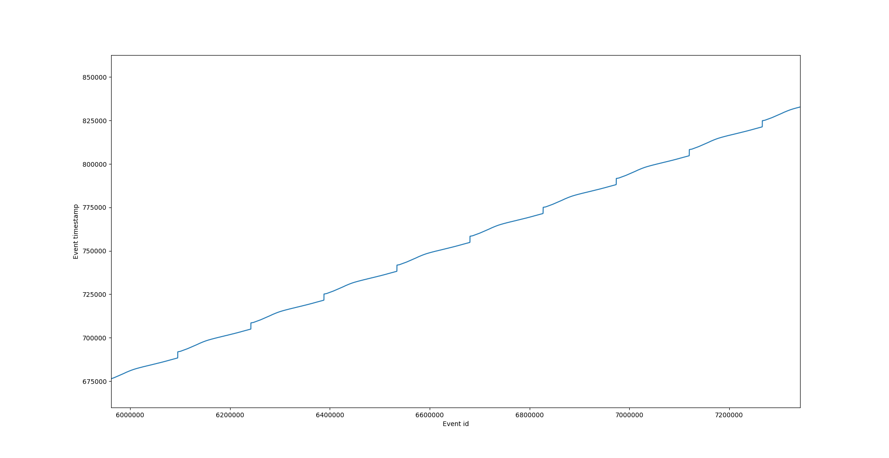

# Event processing
Here we provide guidelines and script that can be used to synchronize and convert the event data.
In our dataset, the synchronization was achieved in two ways:
1. We used an external hardware to synchornize the projector with the event camera. The Prophesee event camera has external trigger pins that were used for this.
We had an audio signal (a square wave of 60Hz) linked to the projector laser. This audio signal was converted to a voltage with a square wave of 60Hz using additional circuitary.
This voltage was connected to the external trigger pins to trigger special events that corresponded to the start of the projector laser.
Please note however, in practice we found that this synchornization would often drift.
Therefore we also used a different method in some sequences:
2. The event timestamps for a scan interval of 16ms has a linear behaviour (overall, while there still might be some jitter in the event timestamps overall they timestamps follow a line). 
The projector laser beam while scanning at 60Hz actually completes the scan within 13ms and is switched off for the 3ms.
So the events therefore follow a behaviour where the timestamp increases linearly upto 13ms and then there are no events for 3ms.
This can be seen when plotting the event timestamps.
<p align="center">
   
</p>

We use this knowledge to search for the pattern and use the first event timestamp of this pattern to synchornize with the projector.
This is slightly more robust to drift. But requires manual tuning.
The code `extract_events.py` will synchronize the events based on the trigger file if available, otherwise it will use the 2nd approach.

## Data visualization
To view the ".raw" files with metavision:
```bash
metavision_viewer -f data.raw
```
Prophesee player also has a functionality to visualize the ".dat" file format with variable speeds to visualize the projector events as below:

<p align="left">
   
</p>

# Event processing
Each sequence is saved in the Prophesee format ".raw". More details can be found at the [official documentation](https://docs.prophesee.ai/stable/data_formats/file_formats/raw.html)
This file format saves two types of events: CD events and Trigger events.
This information is the output of `metavision_raw_info data.raw`
```bash
====================================================================================================

Name                data.raw
Path                data.raw
Duration            14s 441ms 23us 
Event encoding      EVT2
Camera generation   3.0
Camera systemID     21
Camera subsystemID  2415920130
Camera serial       00000333

====================================================================================================

Type of event       Number of events    First timestamp     Last timestamp      Average event rate  
----------------------------------------------------------------------------------------------------
CD                  138068754           48                  14439220            9.6 Mev/s           
External triggers   8665                1266                14441023            600 ev/s   
```
CD events refer to Contrast Detection (CD) event.
To convert the ".raw" file to ".dat" use the metavision code:
```bash
metavision_raw_to_dat data.raw
metavision_raw_to_dat data.raw --trigger
```
This will save the cd events in the file data_td.dat and the trigger events in data_trigger.dat.

```bash
 python3 extract_events.py 
```
This will extract events in between the trigger timestamps and save them as numpy files
Please note the events between the two trigger timestamps are normalized between [0, 1)
More details can be found in the Trigger section

